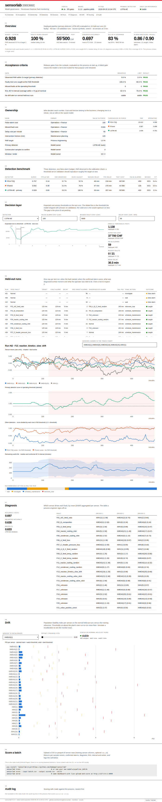

# sensorlab

[](https://github.com/Gemmagf/sensorlab/actions/workflows/ci.yml)
[](https://www.python.org/downloads/)
[](LICENSE)
[](https://github.com/astral-sh/ruff)

> **From sensor telemetry to an operational decision — fault detection, diagnosis and
> remaining-useful-life on the Tennessee Eastman benchmark, packaged as something a plant team
> can actually run.**

`sensorlab` is an end-to-end monitoring pipeline for continuous chemical processes. Three
complementary detectors (multivariate SPC, Isolation Forest, LSTM autoencoder) flag anomalies,
an XGBoost classifier with SHAP attributions names the fault and the sensor driving it, a
conformally-calibrated quantile model bounds the remaining useful life, and a **cost-aware
decision layer** turns all of that into one of four actions: `wait`, `investigate`,
`schedule_maintenance`, `intervene_now`.

The deliverable is not a notebook. It is one fitted object (`MonitoringPipeline`) with a
manifest, a CLI (`sensorlab train | evaluate | score | serve | export-site`), a drift monitor, a
**governance dashboard** published as static files on GitHub Pages (with an optional FastAPI
scoring backend for live use) and an [operations runbook](docs/runbook.md) — built the way a
forward-deployed engineer hands a model to the people who will live with it.

---

## 🚀 Quick start

New here? Read the **[user guide](docs/guide.md)** (install, CLI, Python API, how to read every
output and every dashboard section, bringing your own plant, FAQ). The dashboard has the same
guide behind its **"? How to use it"** button. Operating a deployed model? The
**[runbook](docs/runbook.md)**.

```bash
make install                         # .venv (Python 3.11), CPU torch, app + dev extras
make test                            # 110 tests, ~30 s

sensorlab train                      # fit on synthetic TEP-like data, evaluate on held-out runs,
                                     # -> models/pipeline.joblib (+ manifest), artifacts/train_results.json
sensorlab score --input batch.csv --output scored.csv --drift
                                     # one row per sample: scores, confirmed alarm, fault, RUL, action
sensorlab evaluate --seeds 0 1 2     # the multi-seed numbers below (~1 min)

sensorlab export-site                # static governance dashboard -> site/ (what GitHub Pages serves)
make serve                           # same dashboard with live upload-and-score, http://127.0.0.1:8000
make notebook                        # 01_eda … 06_pipeline
```

Real benchmark instead of the generator: `make download-tep` (~5 GB, Rieth et al. 2017),
`pip install -e ".[real]"`, `python scripts/prepare_tep.py`, then `sensorlab train --data real`.

## 🏗️ What ships and how it fits together

```
                 ┌──────────────────────────────────────────────────────────────────┐
  telemetry ───► │  MonitoringPipeline                          models/pipeline.joblib │
  (X, run_id)    │                                                + .manifest.json     │
                 │  Standardizer (train-normal)                                       │
                 │     ├─ PCA T²/Q  ─┐                                                │
                 │     ├─ IForest   ─┼─ per-sample scores ─► FAR threshold (val-normal) │
                 │     └─ LSTM-AE  ─┘        │              cost-optimal threshold (val)│
                 │                           ▼                                        │
                 │  window features ─► XGBoost + SHAP ─► fault id, driver sensor       │
                 │                  ─► quantile GBM + conformal margin ─► RUL [p10,p90]│
                 │                                                                    │
                 │  confirmed alarm × fault × RUL vs horizon ─► action                 │
                 │  DriftMonitor (PSI vs train-normal) ─► stable / watch / alert       │
                 └──────────────────────────────────────────────────────────────────┘
                        ▲                     ▲                       ▲
              sensorlab train         sensorlab score          sensorlab serve
              sensorlab evaluate      (batch CSV/parquet)      governance dashboard + /api
```

* **`sensorlab.data`** — `TEPDataset` is the contract every source satisfies (synthetic
  generator, Rieth 2017 release, or your plant). `validate()` enforces it; `active_fault_id`
  is the label that is true *at time t*; `windows_to_per_sample` is the single place
  window-level outputs are mapped back to the sample axis.
* **`sensorlab.detection`** — three detectors behind one `fit(X_normal) / score(X)` interface,
  plus delay / FAR / AUROC metrics that operate on whole runs.
* **`sensorlab.diagnosis`**, **`sensorlab.rul`**, **`sensorlab.decision`** — the supervised
  heads and the expected-cost threshold sweep.
* **`sensorlab.pipeline`** — the artefact: `fit / predict / evaluate / save / load`, config as
  a dataclass, manifest as JSON.
* **`sensorlab.evaluation`** — leakage guards (whole-run masks, validation-only thresholds) and
  multi-seed aggregation. **`sensorlab.monitoring`** — PSI drift. **`sensorlab.cli`** — the
  five commands.
* **`sensorlab.server`** — FastAPI app: `/api/health`, `/api/overview`, `/api/runs`,
  `/api/decision`, `/api/diagnosis`, `/api/drift`, `POST /api/score`, `/api/audit`, plus the
  static governance dashboard (plain HTML/SVG, no build step, works offline).

## 🔬 Results

Reference configuration (`sensorlab evaluate --seeds 0 1 2`): synthetic generator, 96 runs of
160 samples at 3 min (12 normal, 4 per fault × 21 faults), 33 sensors. Runs are split
**49 / 23 / 24** into train / validation / test **by run**; every number below is on the
**24 held-out test runs** (21 faulty), with thresholds fixed on validation. Mean ± std over
three seeds, straight from [`artifacts/results.json`](artifacts/results.json) — the dashboard
reads the same file.

### Detection — threshold at 1 % FAR on validation-normal

| Detector          | AUROC             | TPR @ FAR 1 %   | FAR observed | Faulty runs caught | Median delay | p90 delay | Fit   |
|-------------------|------------------:|----------------:|-------------:|-------------------:|-------------:|----------:|------:|
| Hotelling T² + Q  | 0.81 ± 0.04       | 0.34 ± 0.14     | 1.2 %        | 76 %               | 38 ± 11 min  | 201 min   | 0.0 s |
| Isolation Forest  | 0.84 ± 0.01       | 0.32 ± 0.17     | 0.7 %        | 75 %               | 42 ± 14 min  | 220 min   | 0.6 s |
| **LSTM-AE**       | **0.92 ± 0.02**   | **0.68 ± 0.10** | 3.8 %        | **98 %**           | **28 ± 5 min** | 156 min | 1.3 s |

**What this tells us.** The recurrent model reads the temporal signature the other two ignore
and catches nearly every faulty run with the shortest lead time. It also over-shoots the
false-alarm target on test (3.8 % vs 1 %): its validation-normal scores are tighter than its
test-normal scores, so its threshold generalises worse than the two classical detectors'. The
"FAR observed" column is the calibration check a plant team should ask for; without it the
AUROC over-sells the LSTM.

### Decision layer — operating threshold chosen on validation, cost measured on test

Reference cost mix: false alarm 100 CHF, missed fault 5 000 CHF, 50 CHF per minute of delay.

| Detector          | Test cost (CHF)       | False alarms / 1 320 normal samples | Missed faults / 21 | Mean delay   |
|-------------------|----------------------:|------------------------------------:|-------------------:|-------------:|
| Hotelling T² + Q  | 54 600 ± 8 300        | 356 ± 108                           | 0                  | 18 ± 3 min   |
| **Isolation Forest** | **48 200 ± 4 800** | **244 ± 76**                        | 0                  | 23 ± 8 min   |
| LSTM-AE           | 49 300 ± 5 000        | 241 ± 135                           | 0                  | 24 ± 9 min   |

**What this tells us.** At a 50 : 1 missed-to-false-alarm ratio every detector is pushed into a
zero-miss regime and the ranking flips: the cheapest detector on test is Isolation Forest, not
the one with the best AUROC, and the difference between the two is within seed noise. The
pipeline's `auto` primary-detector rule (cheapest on validation) picked LSTM-AE on one seed and
Isolation Forest on two — which is the honest answer: at this cost mix they are interchangeable
and the choice should be made on inference cost and interpretability. Change the cost mix and
the answer changes; that is what the dashboard's Decision tab is for.

### Diagnosis — 22-way classification of the fault *active at time t*

| Accuracy        | Balanced accuracy | Macro-F1        | Fit  |
|----------------:|------------------:|----------------:|-----:|
| 0.70 ± 0.01     | 0.63 ± 0.01       | 0.63 ± 0.01     | 9 s  |

**What this tells us.** Version 0.1 reported 0.57 on the same data. The gain comes from a label
fix, not a model change: pre-onset samples of a faulty run are nominal and were being labelled
with the run's fault id, which asked the classifier to separate identical distributions. The
remaining errors concentrate on faults that share a mechanic in the synthetic catalogue (e.g.
F04 / F11 / F14 all lean on `XMEAS(21)`); SHAP gives one dominant driver sensor per fault, which
is the mean-time-to-root-cause lever on a real plant.

### Remaining useful life — quantile GBM with a split-conformal margin

| MAE (median)  | 80 % coverage, raw | 80 % coverage, conformal | Interval width | Conformal margin | Fit  |
|--------------:|-------------------:|-------------------------:|---------------:|-----------------:|-----:|
| 91 ± 3 min    | 59 %               | **83 %**                 | 279 min        | 31 min           | 1.6 s |

**What this tells us.** A raw quantile GBM under-covers badly on held-out runs. Calibrating the
interval on the validation runs (conformalized quantile regression) restores nominal coverage
with no retraining and a 31-minute widening — that is the difference between an interval an
operator can plan around and one that is quietly wrong one time in two. The MAE is ~20 % of the
run length: useful for ranking runs by urgency, not for service-level promises. On this
benchmark the target is *time until the end of the run*, a deterministic function of time since
onset, so it measures how well the process state encodes elapsed fault time rather than a
physical time-to-failure.

### End to end — what the operator receives on the test runs

Confirmed-alarm precision 0.90 ± 0.05 and recall 0.71 ± 0.14 per sample; every faulty test run
gets a confirmed alarm, and the per-run table in the dashboard (section 06) shows, for each
run, the onset, the first alarm after it, the fault diagnosed at that moment, the RUL median
and the final action.

## 🧭 Deployment story

```bash
sensorlab train                     # models/pipeline.joblib + pipeline.manifest.json
sensorlab export-site               # site/ — plain HTML + JSON, published by .github/workflows/pages.yml
sensorlab serve                     # optional: the same page with live scoring, http://127.0.0.1:8000
curl -F file=@batch.csv "http://127.0.0.1:8000/api/score?format=csv" > scored.csv
```

**Live on GitHub Pages:** every push to `main` trains the reference model, exports the
dashboard (every panel precomputed to JSON, the cost curve priced in the browser from
cost-independent counts, the drift simulator from a sensor × offset grid) and deploys the
folder. No server, no cloud account, nothing that phones home — a governance page anyone
with the link can read. Enable it once under *Settings → Pages → Source: GitHub Actions*.



The dashboard is a **governance page, not a notebook in a browser**: model identity and
health, the runbook's acceptance gates evaluated live (PASS/FAIL), who owns each knob and the
value in force, the detection benchmark with the FAR calibration check, the cost curve with
the shipped threshold against the oracle, every held-out run with its outcome and an inspector
(traces, score vs threshold, RUL band, action timeline), SHAP driver sensors, PSI drift with a
recalibration simulator and — in the live build only — an upload-and-score form with an audit
log of every scoring call. Plain HTML and SVG, no build step, works from a file server.

1. **One artefact, one manifest.** `sensorlab train` writes `pipeline.joblib` and a JSON model
   card (version, config, sensor layout, thresholds, fit report). `sensorlab info` prints it.
2. **A contract with operations.** `predict` returns an `action` column with four values and a
   deterministic rule set documented in the [runbook](docs/runbook.md). The cost mix and the
   intervention horizon are inputs owned by the business, not hyper-parameters.
3. **No peeking.** Scaler and detectors see normal training runs only; FAR thresholds come from
   validation-normal, the operating threshold from validation runs; every reported number is on
   test. `evaluate` refuses masks that split a run.
4. **It knows when it is out of its depth.** `check_drift` reports per-sensor PSI against the
   training-normal distribution, with thresholds set above the plant's own run-to-run noise
   floor (measured leave-one-run-out at fit time); the runbook says what `watch` and `alert`
   mean and who acts.
5. **It runs without a data scientist.** `sensorlab score --input batch.csv --drift` in a
   scheduled job, or `POST /api/score` from the plant historian when the API is on; the
   governance page itself is static and republished by CI on every push to `main`.

### Onboarding another plant

Write one function that returns a `TEPDataset` (sensor matrix, contiguous run ids, per-run
onsets and fault labels — see the class docstring), call `validate()`, and everything else is
source-agnostic. `dataset_from_rieth_frame` is the worked example for the real benchmark:
case-insensitive column matching, unique run ids from `(split, faultNumber, simulationRun)`,
onset at sample 20 (train files) or 160 (test files).

## 🧪 Engineering discipline

* 110 tests in ~30 s, including an end-to-end pipeline fit / predict / save / load / evaluate on a
  tiny dataset, a CLI round trip through `train → score → info`, the API served through
  FastAPI's test client (upload, CSV download, audit, 404/422 paths) and the static export.
* CI on Python 3.11 and 3.12: ruff, pytest with coverage, CLI smoke test. CPU-only torch keeps
  the job short.
* Notebooks are generated from `scripts/build_notebooks.py` and executed, so they cannot drift
  from the library.
* Platform shims (`_compat.py`) handle the macOS libomp clash between PyTorch and XGBoost and
  apply thread caps there only.

## 🧱 Known limitations and next steps

* **Synthetic data.** The generator maps 21 faults onto 7 mechanics with the same onset fraction;
  the real release will shift every number. Running `--data real` is the first thing to do
  before believing the tables above.
* **LSTM-AE FAR calibration.** 3.8 % observed vs 1 % target: a larger validation-normal set or
  a per-run score normalisation would close it.
* **Hierarchical diagnosis** (fault family → sub-type) for the confusable pairs.
* **Drift on marginals only.** PSI misses correlation changes; a T²-on-normal-periods check is
  the natural complement.
* **RUL semantics.** A benchmark with variable failure times is needed before "time-to-failure"
  means what an operator thinks it means.

## 📦 Layout

```
src/sensorlab/
├── config.py            paths, real TEP spec (41 XMEAS + 11 XMV, onset conventions)
├── data/                synthetic generator · loaders (synthetic / Rieth) · windows & splits
├── detection/           PCA T²/Q · IsolationForest · LSTM-AE · run-level metrics
├── diagnosis/           window features · XGBoost · SHAP per sensor
├── rul/                 quantile GBM + conformal margin · Cox baseline (optional extra)
├── decision/            cost model · threshold sweep
├── evaluation.py        leakage-guarded evaluation · multi-seed aggregation
├── monitoring.py        PSI drift monitor
├── pipeline.py          MonitoringPipeline: fit / predict / evaluate / save / load
├── cli.py               sensorlab train | evaluate | score | serve | export-site | info
├── server/              FastAPI app, static export, governance dashboard (index.html, app.js, styles.css)
└── viz/                 matplotlib helpers
notebooks/               01_eda … 06_pipeline (generated + executed)
docs/guide.md            user guide (install, CLI, API, reading outputs and the dashboard, FAQ)
docs/runbook.md          operations runbook
.github/workflows/       ci.yml (lint, tests, CLI smoke) · pages.yml (train, export, deploy to GitHub Pages)
Dockerfile               optional live API: python:3.11-slim, CPU torch, model trained at build
artifacts/results.json   multi-seed held-out results (source of truth for the tables above)
```

## 📚 References

- Downs, J.J. & Vogel, E.F. (1993). *A plant-wide industrial process control problem*. Computers & Chemical Engineering.
- Bathelt, A., Ricker, N.L. & Jelali, M. (2015). *Revision of the Tennessee Eastman process model*. IFAC-PapersOnLine.
- Rieth, C.A. et al. (2017). *Issues and Advances in Anomaly Detection Evaluation for Joint Human-Automated Systems*. Harvard Dataverse.
- Romano, Y., Patterson, E. & Candès, E. (2019). *Conformalized Quantile Regression*. NeurIPS.
- Jackson, J.E. & Mudholkar, G.S. (1979). *Control procedures for residuals associated with principal component analysis*. Technometrics.

## 📄 License

MIT — see [LICENSE](LICENSE).
